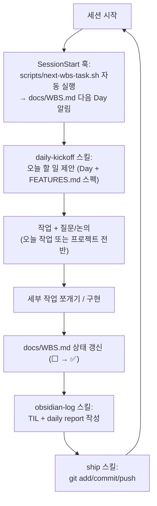

# 매일 작업 루틴

fleet_web은 학습 목적 사이드 프로젝트라, 매 세션을 같은 흐름으로 반복한다. 이 문서는 그 흐름과, 각 단계를 담당하는 스킬/훅을 한 곳에 정리한 것이다.

## 흐름

## 단계별 담당

| 단계 | 담당 | 자동 실행 여부 |
| --- | --- | --- |
| 세션 시작 시 다음 작업 알림 | `scripts/next-wbs-task.sh` | ✅ SessionStart 훅으로 자동 실행 (`.claude/settings.json`) |
| 오늘 할 일 구체적으로 제안 | `.claude/skills/daily-kickoff` | 대화 중 자연스럽게 적용 (필요 시 "오늘 뭐 해야 돼" 등으로 명시 호출) |
| 작업/질문/세부 작업 조율 | (스킬 없음, 일반 대화) | - |
| Obsidian TIL + daily report 작성 | `.claude/skills/obsidian-log` | 세션 종료 시 명시 호출 ("TIL 작성해줘" 등) |
| GitHub 커밋/푸시 | `.claude/skills/ship` | 세션 종료 시 또는 작업 중간중간 명시 호출 ("git에 올려줘" 등) |

## 관련 문서/파일

- [`WBS.md`](./WBS.md): 오늘 뭘 할지 (Day 단위)
- [`FEATURES.md`](./FEATURES.md): 그 작업이 정확히 뭘 만드는지
- [`ROADMAP.md`](./ROADMAP.md), [`STRUCTURE.md`](./STRUCTURE.md): Phase 전체 맥락과 아키텍처
- Obsidian vault: `sideproj/fleet_web/TIL/{날짜}.md`, `sideproj/fleet_web/daily report/{날짜}.md`
- GitHub: `Koeunseooooo/robot-fleet` (main 브랜치 직접 push)

## 왜 이렇게 나눴는가

- **세션 시작 알림(훅)과 작업 제안(스킬)을 분리**한 이유: 훅은 사람이 아무 말도 하기 전에 자동으로 컨텍스트를 주입하는 것이라 "오늘 뭐하지"를 놓치지 않게 해주고, 스킬은 그 알림을 실제 대화/제안으로 풀어내는 역할을 한다. 훅만으로는 자연스러운 대화형 제안이 안 되고, 스킬만으로는 매번 사용자가 먼저 물어봐야 한다.
- **작업 중 질문/논의는 스킬화하지 않았다**: 이 부분은 매번 내용이 달라서 정해진 절차로 굳히면 오히려 방해가 된다. 자연스러운 대화로 남겨둔다.
- **기록(obsidian-log)과 반영(ship)을 분리**한 이유: TIL/daily report는 "무엇을 배웠는지" 기록이고 git push는 "무엇을 만들었는지" 반영이라 목적이 다르다. 세션 중간에 여러 번 ship만 하고 obsidian-log는 세션 끝에 한 번만 하는 식으로 독립적으로 쓸 수 있어야 하기 때문.
