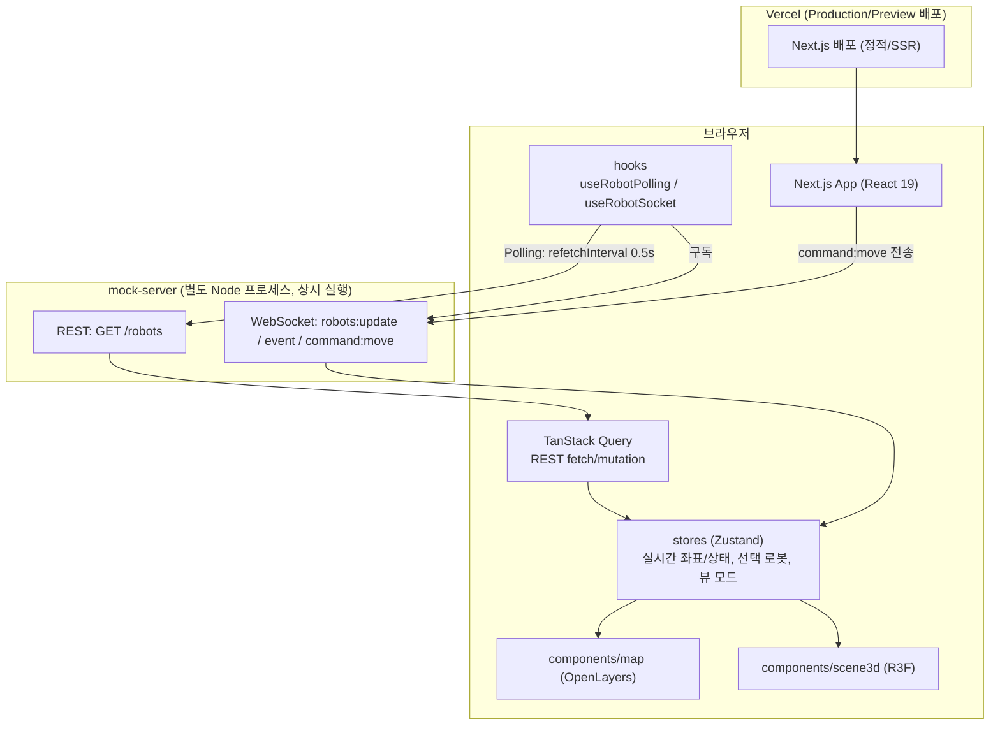
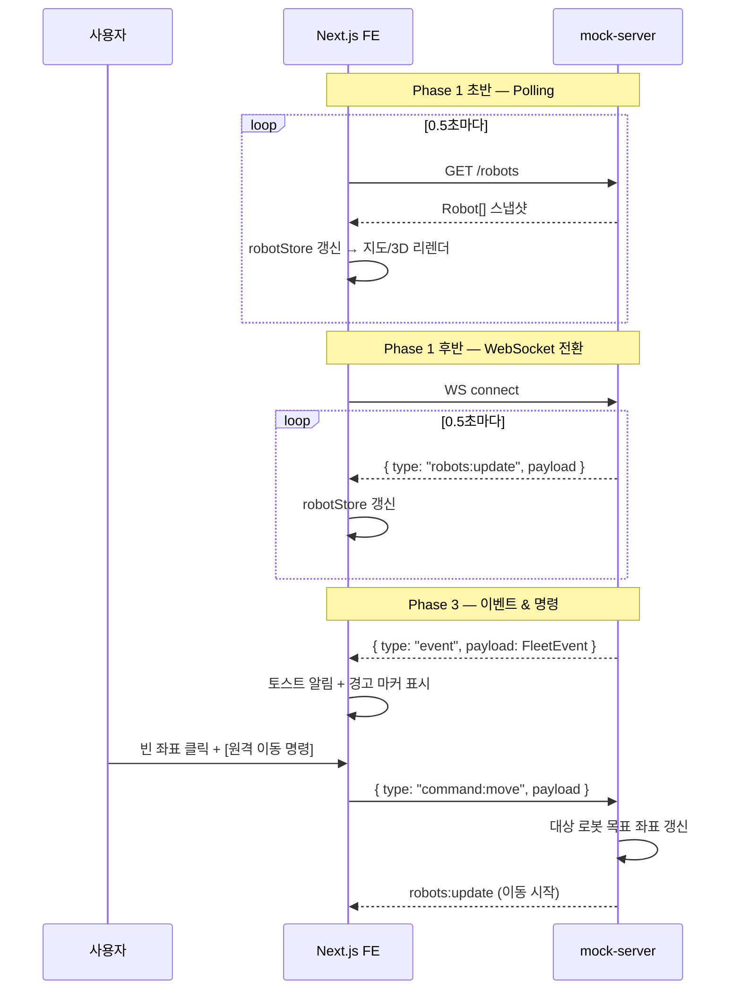
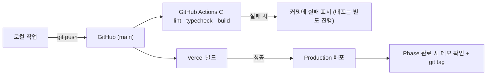

# 프로젝트 구조

Phase 1~3 전체를 고려해 설계한 디렉토리 구조. Next.js App Router 기반.

```
fleet_web/
├── README.md                  # 저장소 진입점, 문서 안내
├── AGENTS.md / CLAUDE.md       # AI 코딩 에이전트용 컨텍스트
├── docs/
│   ├── ROADMAP.md              # Phase별 목표/기능/기술 스택
│   ├── STRUCTURE.md            # 이 문서
│   ├── WBS.md                  # 하루 30분 단위 작업 분해
│   └── FEATURES.md             # 기능 명세서 (WBS와 1:1 대응하는 상세 스펙)
├── .storybook/                 # Storybook 설정 (main.ts, preview.tsx)
├── mock-server/               # 로봇 좌표/상태/이벤트를 발행하는 별도 Node 프로세스
├── src/
│   ├── app/                   # Next.js 라우트 (페이지, 레이아웃)
│   ├── components/
│   │   ├── map/                # OpenLayers 2D 지도 (Phase 1)
│   │   ├── scene3d/            # Three.js/R3F 3D 뷰 (Phase 2)
│   │   ├── robot-list/         # 좌측 로봇 리스트 패널 (Phase 1)
│   │   ├── controls/           # 2D/3D 토글, 원격 명령 패널 (Phase 2~3)
│   │   ├── notifications/      # 토스트/경고 마커 (Phase 3)
│   │   └── ui/                 # 공용 UI 프리미티브 (컴포넌트 + *.stories.tsx co-located)
│   ├── hooks/                  # 실시간 스트림 구독, 카메라 추적 등 훅
│   ├── stores/                 # 전역 상태 (로봇 좌표/상태, 뷰 모드, 이벤트 큐)
│   ├── lib/                    # WebSocket/HTTP 클라이언트, 유틸
│   ├── types/                  # Robot, Position, FleetEvent 등 도메인 타입
│   └── constants/              # 격자 크기, 색상 등 설정값
└── public/
```

**Storybook / 테스트 파일 위치**: `*.stories.tsx`와 `*.test.tsx`는 대상 컴포넌트 옆에 co-locate한다 (예: `src/components/ui/Button.tsx` + `Button.stories.tsx`). 별도 `__stories__`/`__tests__` 폴더로 분리하지 않는다 — 컴포넌트를 지우거나 옮길 때 관련 파일을 같이 챙기기 쉽도록.

## 아키텍처 다이어그램

### 시스템 구성



### 실시간 데이터 흐름 (Phase 1: Polling → WebSocket, Phase 3: Command)



### CI/CD 파이프라인



## 설계 원칙

- **도메인 축 분리**: `map`(2D) / `scene3d`(3D)를 별도 컴포넌트 트리로 두고, 좌표 데이터는 `stores`를 통해 공유한다. Phase 2에서 2D/3D를 토글해도 데이터 소스는 하나.
- **데이터 흐름 단일화**: `mock-server` → `hooks`(구독) → `stores`(전역 상태) → `components`(렌더링) 순서로 흐른다. Polling에서 WebSocket으로 전환해도 `hooks` 레이어만 교체하면 되도록 경계를 둔다.
- **Phase별 확장 가능**: 각 폴더는 이후 Phase에서 채워질 것을 전제로 미리 자리를 잡아둔 것이며, 지금 당장 모든 폴더에 구현체가 있을 필요는 없다.

## 다음 단계 (Phase 1 착수 시)

- `mock-server` 스펙 확정: 로봇 좌표/상태 포맷, 발행 주기(0.5초), 엔드포인트(Polling REST → WebSocket)
- `src/types`에 `Robot`, `Position`, `RobotStatus` 타입 정의
- `src/stores`에 로봇 상태 스토어 구현 (Zustand 등 검토)
- `src/components/map`에 OpenLayers 격자 배경 + 로봇 레이어 구현
